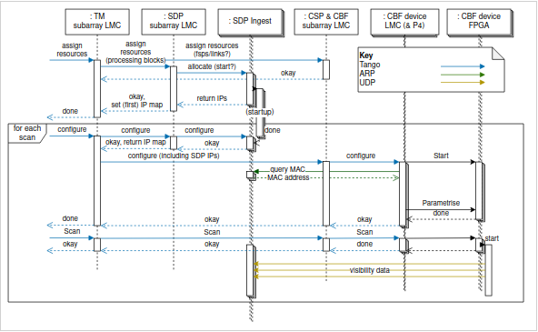

******************
ARP Traffic routing in AA0.5
******************

In this document, we aim at describing how, in AA0.5, the P4 switch will provide ARP legacy
interfacing with both upstream (SPS) and downstream (PSR and SDP)

Overall, in this repo we are interested in describing the way a particular table in the
switch can be configured to provide this interfacing.

Using ARP to help SDP topology
###############

For the downstream integration with SDP, Low.CBF needs to before sending any data to discover the MAC address associated to a given SDP node as shown in the diagram below from `ECP-210085 - CBF, PSS, PST to obtain the destination MAC address using ARP <https://confluence.skatelescope.org/display/CMI/ECP-210085+-+CBF%2C+PSS%2C+PST+to+obtain+the+destination+MAC+address+using+ARP>`_.

As a result, we foresee that the ARP integration for communication to SDP could be achieved as follows:

* Low CBF receives Correlator configuration alongside destination IP addresses for the various outputs (from TM subarray LMC via CSP&CBF subarray LMC)
* Low.CBF allocator configures Alveos and P4 switch accordingly
* P4 switch configuration consists in routing port and/or destination IP address that match the various configuration. In more details:
    * Configuration is done via Tango which in turn configures the SKA connector
    * SKA connector would:
        * If Intermediate switch, just apply configuration as it knows destination port (i.e. I/O switch)
        * If I/O switch, the procedure would be as follows:
            * Connector passes IP address to an internal ARP resolver thread
            * Thread sends ARP queries via local Linux interface connected to port 65/0 on the switch (and listen on the same interface for responses)
            * These queries are broadcasted to all downstream ports to SDP
            * P4 switch should receive response on a single port (MAC address green arrow in the diagram above) and as a result it will generate a packet containing <IP@, Mac@, received_port> information to port 65/0
            * Using this information SKA connector configures P4 table associated to this configuration
            * Switch would modify packets on the fly  to have correct addresses during sending of the visibility data
            * In the background ARP resolver would continue to send query to mitigate potential reconfiguration downstream and help SDP maintaining their topology
            * If changes are detected the SKA connector will re-configure table automatically
* Association table <IP@, Mac@> would be accessible via Tango at anytime

In regards to the data stream going to PSS and PST, it is assumed at the moment that the integration via ARP would follow a similar procedure as for SDP.

P4 table
################

In order interface with ARP both upstream and downstream we have developed a single P4
table with 3 actions.

.. code-block:: none

    @name(".arp_table")
    table arp_table {
        key = {
            hdr.arp.tpa: exact @name("target_ip");
        }
        actions = {
            answer_arp_request;
            send_arp_to_sdp;
            send_reply_from_sdp;
            @defaultonly nop;
        }
        size = 1024;
        counters = direct_counter_arp;
        default_action = nop();
    }

In this table, regardless of the potential action, every ARP packets is going to be matched
on the Target IP address. This target IP address represents:

* The IP address to be resolved when ARP operational mode is 1 (request)
* The IP address of the node sending the original request when the ARP operational mode is 2 (reply)

Answering ARP requests from SPS
++++++++++++++++

In order to receive data from SPS, Low.CBF might need to answer to ARP requests.
These replies are generated inside the I/O switch in Low CBF via the dedicated routing table. In this table, the P4 switch will:

* match a ARP request IP address querry;
* modify the ARP request packet and transform it into a reply packet;
* configure the reply with pre-defined MAC address.

In this particular case the configured action from the P4 table is "answer_arp_request"
which take a MAC address (48bits) as an argument. This MAC address in the context of the
SKA represents the full CBF block.

.. code-block:: none

    @name(".answer_arp_request")
    action answer_arp_request(mac_addr_t my_eth_addr) {
        direct_counter_arp.count();
        hdr.arp.tha = hdr.arp.sha;
        hdr.arp.tpa = hdr.arp.spa;;
        hdr.arp.sha = my_eth_addr;
        hdr.arp.spa = ig_md.dst_ip;
        hdr.arp.oper = ARP_OPER_REPLY;
        hdr.ethernet.dst_addr = hdr.ethernet.src_addr;
        hdr.ethernet.src_addr = my_eth_addr;
        ig_tm_md.ucast_egress_port = ig_intr_md.ingress_port;

    }

Sending ARP requests to SDP
++++++++++++++++

In order to provide the topology discovery via ARP in the downstream network, Low CBF
needs to send periodically ARP requests to every ports connecting the Low CBF to the SDP.
This is accomplished via the combination of the ARP table and P4 switch multicasting capabilities.

Indeed, using the aforementioned P4 table, we have configured the "send_arp_to_sdp" action
to associate any SDP IP Addresses with a multicast group within the P4 switch. This
translates effectively to multicasting ARP requests originating from the connector to a
list of switch ports given by the Low CBF Allocator.

.. code-block:: none

    @name(".send_arp_to_sdp")
    action send_arp_to_sdp(bit<32> ifid) {
        ig_md.ifid = ifid;
        direct_counter_arp.count();
        ig_tm_md.ucast_egress_port = 9w0x1ff;

    }

This multicast is using the dedicated multicast group number 2 where number 1 is used by PTP,
and > 2 by the SPS to CBF traffic in AA0.5.

Receiving replies from SDP
++++++++++++++++

The final action is slightly more complex as we aim at extracting 2 information from the
SDP replies. First we want to capture the MAC address of a given IP address so that we
can later on correctly associate this MAC address in the visibility traffic. This first
information is extracted directly from the ARP protocol itself.

The second information we want to capture is to find out which physical P4 switch port is
connected to the SDP switch port responsible for this address. This information is obviously
not related to ARP protocol but with the intrinsic metadata of the P4 switch. Also note
that, in the context of AA0.5 this is trivial as only one port is connected to SDP.

Overall, this is done by the action shown below.

.. code-block:: none

    @name(".send_reply_from_sdp")
    action send_reply_from_sdp(PortId_t dest_port, ipv4_addr_t dst_ip_addr,
                                ipv4_addr_t src_ip_addr) {
        hdr.ethernet.ether_type = ETHERTYPE_IPV4;
        hdr.arp.setInvalid();
        hdr.ipv4.setValid();
        hdr.ipv4.src_addr = src_ip_addr;
        hdr.ipv4.dst_addr= dst_ip_addr;
        hdr.ipv4.total_len = 58;
        hdr.ipv4.flags = 2;
        hdr.ipv4.ihl = 5;
        hdr.ipv4.version = 4;
        hdr.ipv4.ttl = 64;
        hdr.ipv4.diffserv = 0;
        hdr.ipv4.identification = 1;
        hdr.ipv4.protocol = IP_PROTOCOLS_UDP;
        hdr.udp.setValid();
        hdr.udp.hdr_length = 38;
        hdr.ipv4.flags = 2;
        hdr.udp.dst_port = 5280;
        hdr.arp_resolution.setValid();
        hdr.arp_resolution.dst_port = ig_intr_md.ingress_port;
        hdr.arp_resolution.dst_mac_addr = ig_md.dst_mac_add;
        hdr.arp_resolution.dst_ip_addr = hdr.arp.spa;
        direct_counter_arp.count();
        ig_tm_md.ucast_egress_port = dest_port;

    }