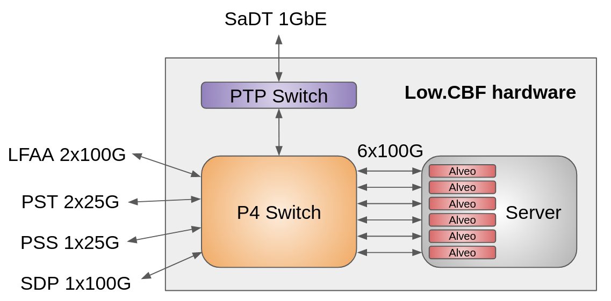
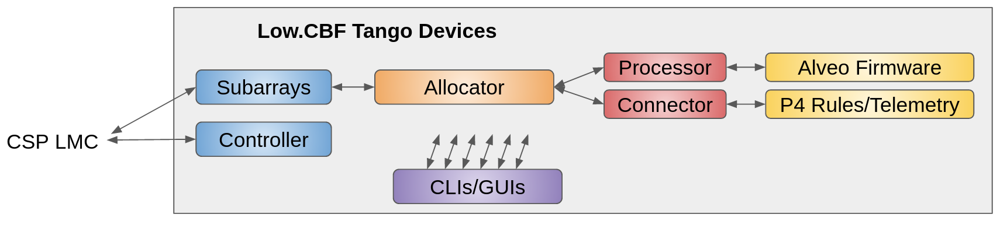

******************
P4 switch in AA0.5
******************

Low CBF in AA0.5
################

The overall configuration of Low CBF in AA0.5 consists in:

* P4 switch
* Comtel Server with 6 Alveo cards
* PTP switch

These elements are in turn connected via the P4 switch to the rest of the infrastructure as shown in the diagram below.

While in term of astronomy related traffic most of the connectivity to LFAA, PST, PSS, and SDP are uni-directional, bidirectional connections are required for compliance and support of legacy network elements such as layer 2 switch in the SDP datacenter network.

Low CBF software in AA0.5
#########################

In parallel to the hardware connectivity, in AA.5 Low CBF will have numerous Tango devices to control and monitor itself as depicted below.

In the context of the P4 switch, the M&C can be seen through the lenses of both the Low CBF Allocator and the various GUI/CLIs. In particular, the allocator is in charge of configuring the P4 switch prior to any scans while CLI and GUIs offers maintenance interfaces to the switch as well as displaying various health and monitoring telemetry.
Organisation of P4 AA0.5 documentation

The documentation for AA.5 is organised around two axis, namely data plan functionality and the overall software requirements. In particular:

* Interfacing with SDP in AA0.5 provide the modus operantis of the switch when sending data to SDP. This page also describes the necessary hardware related to this mode.
* Interfacing with PSS/PST in AA0.5 provides the modus operantis of the switch when sending data to PSS. This page also describes the necessary hardware related to this mode.
* Interfacing with SPS in AA0.5 provide the modus operantis of the switch when receiving data from SPS and how to send it to correct Alveo. This page also describes the necessary hardware related to this mode.
* P4 Switch Software and OS in AA0.5 provides an overview of the necessary software and OS requirement to operate and control the P4 switch. The description include updating the previously-used Operating System version, and superseeds the previous install guide.

P4 tables in AA0.5
##################

In order to support the Low CBF in AA0.5, the P4 switch is loaded with several tables that will
route the traffic to the correct correlator/beamformer, provide interfacing to the rest of the
telescope, and enable the traffic telemetry.

Overall, we will have in the P4 switch the following tables:

* ARP table
* ing_port_table table (aka basic table)
* ing_port, a table allowing for basic multicasting
* multiplier_spead table, a table for multiplying SPEAD traffic from SPS
* spead_table, a table for SPEAD routing when only using correlator or beamformer
* ptp_table, a table for PTP traffic
* ing_src_ifid and ing_dmac, 2 tables used when multication of traffic

In the remainder of this documentation, we are going to detail the various tables.