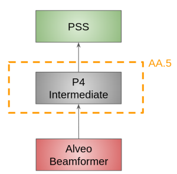

*********************************
Interfacing with PST/PSS in AA0.5
*********************************

WARNING: This is a work in progress

In this document, we aim at describing, for AA0.5, the P4 switch table associated with
routing PSR traffic.

Overall we are interested in describing the operation of the P4 switch in the scenario depicted below.

PSR routing
################

Outgoing traffic
================

In the context of AA0.5, PSS and PST beamformer will generate respectively 21.6 and 25.6 Gbps of raw data.
Computation for the various data rate can be found `here <https://docs.google.com/spreadsheets/d/1Qza66EnFgSQyeJwhoM_vxqVzMsNe8bHSmg6CI6Q3nSk/edit#gid=978340330>`_.
This raw data is encapsulated in `PSR packets <https://docs.google.com/document/d/1MMu38QMe7gUuV_bCBYHYfI6VxVaJby7c/edit>`_.

P4 routing
============

In order to route the packet to alveos the P4 switch leverage information from the PSR header shown below.

.. tabularcolumns:: |C|C|C|C|C|C|C|C|C|
.. table:: PSR Header

    +-------+--------+--------+--------+--------+--------+--------+--------+--------+
    | Word  | Byte 0 | Byte 1 | Byte 2 | Byte 3 | Byte 4 | Byte 5 | Byte 6 | Byte 7 |
    +=======+========+========+========+========+========+========+========+========+
    |     0 |                         Packet Sequence Number                        |
    +-------+--------+--------+--------+--------+--------+--------+--------+--------+
    |     1 |                 Timestamp (attoseconds from integer second)           |
    +-------+--------+--------+--------+--------+--------+--------+--------+--------+
    |     2 | Timestamp (seconds from epoch)    |      Channel Separation (mHz)     |
    +-------+--------+--------+--------+--------+--------+--------+--------+--------+
    |     3 |                      First Channel Frequency (mHz)                    |
    +-------+--------+--------+--------+--------+--------+--------+--------+--------+
    |     4 |             Scale #1              |               Scale #2            |
    +-------+--------+--------+--------+--------+--------+--------+--------+--------+
    |     5 |             Scale #3              |               Scale #4            |
    +-------+--------+--------+--------+--------+--------+--------+--------+--------+
    |     6 |       First Channel Number        | Channel per pkt | Valid Ch per pkt|
    +-------+--------+--------+--------+--------+--------+--------+--------+--------+
    |     7 | No. time sample |   Beam Number   |             Magic Word            |
    +-------+--------+--------+--------+--------+--------+--------+--------+--------+
    |     8 | Pkt Dst|DataPrec|Pwr Avg |  ts/wt | O/S num|O/S den | Beamformer ver  |
    +-------+--------+--------+--------+--------+--------+--------+--------+--------+
    |     9 |                                Scan ID                                |
    +-------+--------+--------+--------+--------+--------+--------+--------+--------+
    |    10 |            Offset #1              |               Offset #2           |
    +-------+--------+--------+--------+--------+--------+--------+--------+--------+
    |    11 |            Offset #3              |               Offset #4           |
    +-------+--------+--------+--------+--------+--------+--------+--------+--------+

In particular, the P4 switch will route traffic using the beam_id to direct the correct traffic to a given Alveo. This routing consists in potential mode from the switch point of view

* unicast PSR routing. In this mode, a beam_id is routed to a single PSS or PST server.

PSR Table
==============

