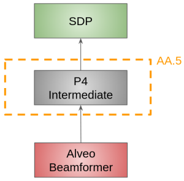

************************************
SDP Traffic routing in AA0.5
************************************

In this document, we aim at describing how, in AA0.5, the P4 switch will route Visibility data
from the correlator Alveo to the SDP cloud.

Overall we are interested in describing the operation of the P4 switch in the scenario depicted below.

In the context of AA0.5, Low CBF correlator will generate  0.2Gbps of raw data. Computation for the various data rate can
be found `here <https://docs.google.com/spreadsheets/d/1Qza66EnFgSQyeJwhoM_vxqVzMsNe8bHSmg6CI6Q3nSk/edit#gid=978340330>`_.
This raw data is encapsulated in `SPEAD <https://casper.astro.berkeley.edu/astrobaki/images/9/93/SPEADsignedRelease.pdf>`_
packet.

P4 routing
================

Prior to generate traffic, Low CBF would have received a list of IP addresses and UDP port numbers for the visibility
traffic. In this context, the programmable switch just needs to perform 2 actions upon reception of SPEAD-SDP traffic:

* IP forwarding based on destination IP address

* MAC address substitution based on the ARP resolution mentioned above.

P4 tables
================

In order to route SPEAD traffic to SDP, the original unicast table called "forward_ip"
is introduced. In this table, the traffic is routed using the destination IP address.

.. code-block:: none

    @name(".forward_ip_table")
    table forward_ip_table {
        key = {
            hdr.ipv4.dst_addr : exact @name("sdp_ip");
        }
        actions = {
            forward_ip;
            @defaultonly nop;
        }
        size = SPEAD_TABLE_SIZE;
        const default_action = nop;
        counters = direct_counter_ipv4;
    }

If a packet is matched the action "forward_ip" is applied. In this action, the
destination port to either the correct SDP pod.

.. code-block:: none

    @name(".forward_ip")
    action forward_ip(PortId_t dest_port) {
        direct_counter_ipv4.count();
        ig_tm_md.ucast_egress_port = dest_port;

    }

In addition, for SDP the switch is responsible for changing the destination MAC address to match the correct MAC
address based on the ARP resolution. To do so, the switch is using a new table as follows:

.. code-block:: none

    @name(".change_mac_dst_table")
    table change_mac_dst_table {
        key = {
            hdr.ipv4.dst_addr : exact @name("sdp_ip");
        }
        actions = {
            change_mac_dst;
            @defaultonly nop;
        }
        size = SPEAD_TABLE_SIZE;
        const default_action = nop;
        //registers = reg_losses;
    }

If a packet is matched the action "change_mac_dst" is applied. In this action, destination mac address is changed.

.. code-block:: none

    @name(".change_mac_dst")
    action change_mac_dst(mac_addr_t mac_add) {
        hdr.ethernet.dst_addr = mac_add;
    }