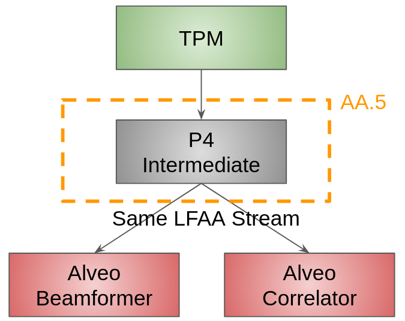
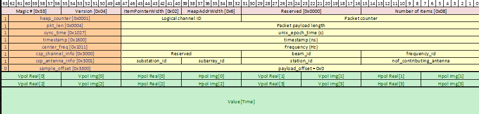
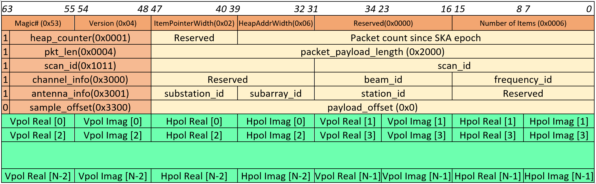

************************************
Interfacing with SPS in AA0.5
************************************

In this document, we aim at describing, in AA0.5, the P4 switch tables associated with
routing SPS traffic, in particular the 2 modeus operanti (unicast vs multiplier).

Overall we are interested in describing the operation of the P4 switch in the scenario depicted below.

Hardware
################

In this configuration the P4 switch is using 8 of the 100G ports as follows:

* 6 ports connected to the Alveo server using 100G DAC cables
* 2 ports connected to SPS using 100G QSFP LR

In addition, the P4 switch is using 2 10G ports, one for the Management&Control and one for connection to the PTP switch.

LFAA routing
################

Incoming traffic
================

In the context of AA0.5, SPS will be constituted of 6 stations. From this stations, it will generate traffic over a
75MHz bandwidth with two 16-bits polarisations oversampled at 32/27. As a results this will generate 17Gbps of raw data.
Computation for the various data rate can be found
`here <https://docs.google.com/spreadsheets/d/1Qza66EnFgSQyeJwhoM_vxqVzMsNe8bHSmg6CI6Q3nSk/edit#gid=978340330>`_.
This raw data is encapsulated in `SPEAD <https://casper.astro.berkeley.edu/astrobaki/images/9/93/SPEADsignedRelease.pdf>`_
packets of 8264 bytes for version 1 and 2, and 8248 bytes for version 3.

Upon reception of SPEAD traffic from SPS, Low CBF P4 switch in AA0.5 will route and potentially multiply SPEAD traffic in function of the configured modus operanti of the telescope. In particular, in AA0.5, we are focusing on the following operation of the CBF:

* PSS beamformer
* PST beamformer
* SDP Correlator

It is noteworthy that in AA0.5 PSS and PST beamformer will be identical from the point of view of the firmware. Also zoom mode is not available in AA0.5.

P4 routing
==============

In order to route the packet to alveos the P4 switch leverage information from the SPEAD header shown below.

In particular, the P4 switch will route traffic using the <beam_id, frequency_id, sub_array_id> tuple to direct the correct traffic to a given Alveo. This routing consists in potential mode from the switch point of view

* unicast SPEAD routing. In this mode, a <beam_id, frequency_id, sub_array_id> tuple is routed to a single Alveo.
* multiplier SPEAD routing. In this mode, a <beam_id, frequency_id, sub_array_id> tuple is route to multiple Alveos.

This routing is done by leveraging two tables as we detail below.

SPEAD Unicast Table
===================

In order to route SPEAD traffic from SPS, the original unicast table called "spead_table"
was introduced. In this table, the traffic is routed using the <beam_id, frequency_id,
sub_array_id> tuple.

.. code-block:: none

    @name(".spead_table")
    table spead_table {
        key = {
            hdr.channel.frequency_no: exact @name("frequency_no");
            hdr.station.sub_array: exact @name("sub_array");
            hdr.channel.beam_no: exact @name("beam_no");
        }
        actions = {
            set_egr_port_freq;
            @defaultonly nop;
        }
        size = SPEAD_TABLE_SIZE;
        const default_action = nop;
        //registers = reg_losses;
        counters = direct_counter_spead;

    }

If a packet is matched the action "set_egr_port_freq" is applied. In this action, the
destination port to either the correlator or beamformer is applied. In addition, the
action is recording the packet number to detect potential losses.

.. code-block:: none

    @name(".set_egr_port_freq")
    action set_egr_port_freq(PortId_t dest_port) {
        bit<32> last_pkt_ts;
        direct_counter_spead.count();
        ig_tm_md.ucast_egress_port = dest_port;

    }

SPEAD Multiplier Table
======================

In the more advanced scenario, the P4 is multiplying the traffic so that the same packet
can reach both the correlator and beamformer. This is done via the "multiplier_spead" table
where the traffic is routed using the <beam_id, frequency_id, sub_array_id> tuple.

.. code-block:: none

    @name(".multiplier_spead")
    table  multiplier_spead {
        key = {

            hdr.channel.frequency_no: exact @name("frequency_no");
            hdr.station.sub_array: exact @name("sub_array");
            hdr.channel.beam_no: exact @name("beam_no");
        }

        actions = {
            set_ifid_corr;
            @defaultonly nop;
        }
        size = SPEAD_TABLE_SIZE;
        const default_action = nop;
        counters = direct_counter_spead_corr;
    }

If a packet is matched the action "set_ifid_corr" is applied. In this action, the packet
received an ID relating to a multicast group number. This multicast group number is discoverd
automatically by the connector class.

.. code-block:: none

    @name(".set_ifid_corr")
    action set_ifid_corr(bit<32> ifid) {
        ig_md.ifid = ifid;
        direct_counter_spead_corr.count();
        // Set the destination port to an invalid value
        ig_tm_md.ucast_egress_port = 9w0x1ff;
    }